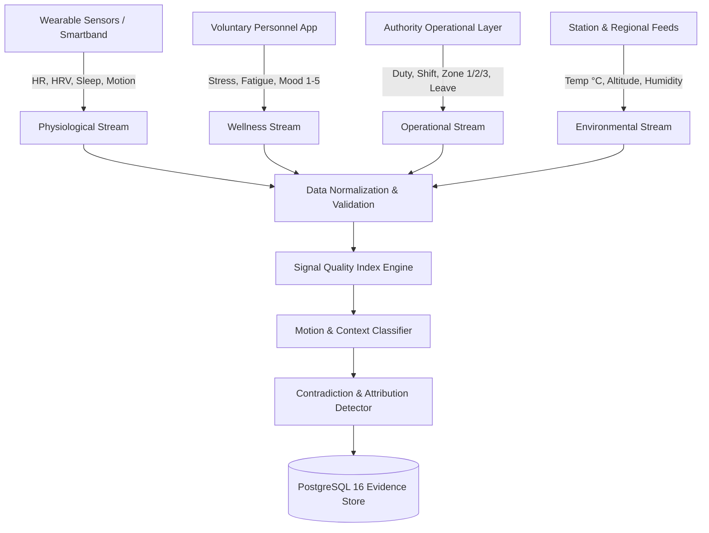
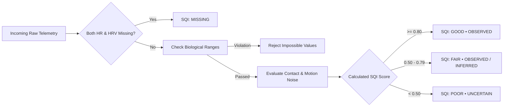

# SEPTERIA: Data Ingestion, Signal Quality & Evidence Pipeline (Phase 4)

**Project**: SEPTERIA  
**SIH Problem Statement**: SIH26186 — AI-Based Predictive Personnel Stress and Welfare Monitoring System for Uniformed Forces  
**Scope**: Multimodal Data Ingestion, Biological Validation, Signal Quality Index (SQI), Motion Contextualization, and Evidence Pipeline Architecture  
**Status**: Implemented, Verified, and Tested (36/36 Backend Tests Passed, 10/10 Mobile Tests Passed)

---

## 1. Executive Summary

Phase 4 establishes the trustworthy, multimodal **Data Ingestion, Signal Quality Index (SQI), and Evidence Pipeline** for SEPTERIA. 

In high-stress uniformed force operations (BSF, CRPF, ITBP, CISF), raw sensor data is noisy, intermittent, and heavily influenced by physical activity and extreme operational environments. The Phase 4 pipeline guarantees that:
1. **Raw measurements are not conflated with psychological risk**.
2. **Physical exertion is recognized as exercise**, reducing psychological distress attribution.
3. **Data provenance and evidence statuses are explicitly preserved** across the entire lifecycle.
4. **Missing data is explicitly tracked as gaps** rather than silently discarded or fabricated as observed measurements.

---

## 2. Multimodal Data Ingestion Streams

SEPTERIA ingests four distinct, synchronized data streams:

### Stream Specifications:
1. **Physiological Stream**:
   - Metrics: Heart Rate (BPM), Heart Rate Variability (rMSSD in ms), Nocturnal Resting Heart Rate (BPM), Sleep Duration (hours), Activity Index (steps/motion intensity), Respiration (breaths/min), Temperature (°C).
   - Provenance: Retains `raw_data_snapshot`, `source`, `device_type`, and `processing_version`.
2. **Voluntary Wellness Self-Reports**:
   - Metrics: 1–5 discrete scales for Stress, Fatigue, Sleep Quality, Mood, and Workload Manageability.
   - Provenance: Private, authenticated jawan check-ins with explicit audit logging.
3. **Authoritative Operational Context**:
   - Metrics: Force, Unit ID, Zone (Zone 1 Active Ops, Zone 2 Border/Remote, Zone 3 Critical Incident), Duty Type, Shift, Location, Temporary Deployment flag, Dynamic Countdown, and Post-Leave Transition state (`Day X / 14`).
   - Managed strictly by commanders and welfare officers.
4. **Environmental Context**:
   - Metrics: Ambient Temperature (°C), Altitude (meters), Relative Humidity (%), Environment Category (High Heat, Extreme Cold, High Altitude, Standard Humid).

---

## 3. Standardized Evidence Hierarchy

Every record and feature vector in SEPTERIA is explicitly stamped with an evidence status:

| Evidence Status | Definition | Example in SEPTERIA |
| :--- | :--- | :--- |
| `OBSERVED` | Direct empirical measurement captured from hardware sensor or voluntary self-report. | Smartband optical PPG reading (HR 72 bpm), voluntary check-in (Fatigue 3/5). |
| `DERIVED` | Mathematical transformation or windowed aggregation of observed values. | 7-day rolling HRV mean, daily sleep duration average. |
| `INFERRED` | Algorithmic estimation or conservative reconstruction over short missing gaps (<15m). | Linear interpolation across a 4-minute sensor dropout for chart continuity. |
| `CONTEXTUAL` | Environmental or authoritative administrative metadata providing operational conditions. | Zone 2 Border Patrol, Tanot Forward Line B, Ambient 42.5°C. |
| `UNCERTAIN` | Measurement present but degraded by motion artifact, poor contact, or discontinuity. | PPG sensor contact rating < 0.40, instantaneous 50 bpm jump without motion. |

---

## 4. Signal Quality Index (SQI) Engine

The prototype SQI engine evaluates incoming telemetry streams into four discrete operational states:

- **`GOOD` (Score $\ge 0.80$)**: High-fidelity signal; physiological metrics within biological limits; sensor contact verified; continuity confirmed.
- **`FAIR` (Score $0.50 - 0.79$)**: Usable signal with minor motion noise, slight optical contact degradation, or conservative inferred reconstruction.
- **`POOR` (Score $0.01 - 0.49$)**: Heavily degraded telemetry; sensor loose or severe motion artifacts. Stamped with `evidence_status = "UNCERTAIN"`.
- **`MISSING` (Score $= 0.00$)**: Telemetry absent during expected sampling interval. Stamped with `evidence_status = "UNCERTAIN"`.

---

## 5. Motion Context & Scientifically Rigorous Attribution

### Core Scientific Principle
**Physiological elevation during physical exercise is cardiovascular adaptation, not psychological distress.** 

To prevent false alarms during tactical patrols, physical drills, or combat maneuvers:

1. **Motion Context Classifier**:
   - `LOW` ($< 3000$ index): Static posture / resting.
   - `MODERATE` ($3000 - 8000$ index): Routine movement.
   - `HIGH` ($8000 - 12000$ index): Active patrol movement.
   - `EXERTIONAL` ($> 12000$ index or $> 8000$ with $\text{HR} \ge 130$ bpm): Heavy tactical maneuver / physical exertion.

2. **Scientific Attribution Outputs**:
   - **High HR + High Activity**:
     > *"Physiological elevation is consistent with physical exertion; psychological attribution reduced."*
   - **High HR + Low Activity (Non-Exertional)**:
     > *"Physiological elevation without physical exertion; potential unexplained physiological deviation."*
   - **Baseline Resting Range**:
     > *"Physiological telemetry within expected baseline resting range."*

---

## 6. Missing Data Tracking & Conservative Reconstruction

SEPTERIA never fakes continuous data or obscures hardware sensor dropouts:

- **Gap Classification**:
  - `SHORT_GAP`: Duration $< 15$ minutes. Eligible for conservative linear interpolation for chart visualization. Reconstructed points are strictly labeled `evidence_status = "INFERRED"`.
  - `LONG_GAP`: Duration $15 - 60$ minutes. Preserved explicitly as missing interval in `missing_intervals` table; not fabricated.
  - `CONTINUOUS_DROPOUT`: Duration $> 60$ minutes. Flags sensor offline condition.
- **Completeness Metrics**:
  - Automatically calculates data completeness percentages across all 4 modalities (Physiological, Wellness, Operational, Environmental).

---

## 7. Synthetic Scenario Catalog (7 Reproducible Scenarios)

The pipeline includes a reproducible test generator (`POST /api/v1/physiology/demo/scenario`) supporting 7 key demonstration scenarios:

1. **Scenario A (Normal Recovery Baseline)**: Stable physiological equilibrium (HR ~70, HRV ~56 ms, Sleep ~7.2h, SQI `GOOD`).
2. **Scenario B (Physical Exertion Protocol)**: HR 145 bpm, Activity 14,500 steps, motion context `EXERTIONAL`.
3. **Scenario C (High Heat & Physical Exertion)**: Ambient 42.5°C desert thermal stress combined with active movement.
4. **Scenario D (Recovery Decline / Workload Strain)**: Cumulative sleep restriction (4.2h), increasing resting HR, and declining HRV trajectory (58 ms $\to$ 32 ms).
5. **Scenario E (Sensor Dropout / 20-Min Missing HRV Gap)**: Injects exact 20-minute gap into minute-level telemetry, creates `MissingInterval` record, calculates completeness (88%), and tags inferred points.
6. **Scenario F (Post-Leave Transition Friction)**: Day 3/14 reintegration state with shift adaptation friction.
7. **Scenario G (Contradictory Signals Assessment)**: Self-reported normal sleep with elevated nocturnal resting HR flagged for contextual review.

---

## 8. Verification & Test Summary

| Test Suite | Total Tests | Passed | Result |
| :--- | :---: | :---: | :---: |
| **Backend Core & Phase 4 Pytest Suite** | 36 | 36 | **100% PASS** |
| - `test_auth.py` | 5 | 5 | PASS |
| - `test_database.py` & `test_health.py` | 3 | 3 | PASS |
| - `test_phase2_operations.py`, `personnel.py`, `rbac.py` | 8 | 8 | PASS |
| - `test_phase3_personnel_mobile.py` | 7 | 7 | PASS |
| - `test_phase4_data_pipeline.py` (Ingestion, SQI, Gaps, Attribution, P-1047 E2E) | 13 | 13 | PASS |
| **Flutter Mobile Test Suite** | 10 | 10 | **100% PASS** |
| - `phase3_personnel_test.dart` | 7 | 7 | PASS |
| - `phase4_pipeline_test.dart` (SQI, Completeness, Gaps) | 2 | 2 | PASS |
| - `widget_test.dart` | 1 | 1 | PASS |
| **Total Automated Tests** | **46** | **46** | **100% PASS** |

---

## 9. Privacy, Security & RBAC Enforcement

- **Strict Personnel Privacy**: Individual jawans can only access their own trends and quality summaries (`GET /api/v1/personnel/me/trends`, `GET /api/v1/personnel/me/quality`). Attempting to query other personnel IDs returns `403 Forbidden`.
- **Commanders & Administrators**: View operational deployment contexts and aggregated stream availability percentages; they never see raw physiological telemetry or private voluntary wellness check-ins.
- **Audit Logging**: All ingestion batches and scenario executions generate structured, immutable audit log records.
