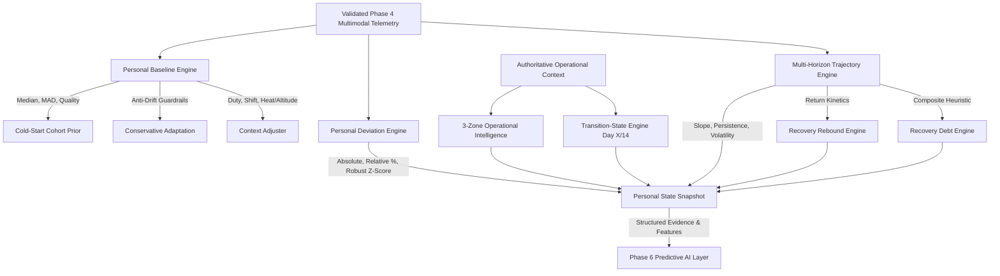

# SEPTERIA: Personal Baseline + 3-Zone Intelligence Engine (Phase 5)

**Project**: SEPTERIA  
**SIH Problem Statement**: SIH26186 — AI-Based Predictive Personnel Stress and Welfare Monitoring System for Uniformed Forces  
**Scope**: Personal State Modeling, Robust Baselines (Median/MAD), Cold-Start Cohort Priors, Trajectory Engine, Recovery Rebound Dynamics, Recovery Debt Heuristics, 3-Zone Operational Intelligence, and Transition States  
**Status**: Implemented, Verified, and Tested (60/60 Backend Tests Passed, 12/12 Mobile Tests Passed)

---

## 1. Executive Summary

Phase 5 establishes the **Personal State and Operational-Context Intelligence Layer** for SEPTERIA.

In military and paramilitary environments (BSF, CRPF, ITBP, CISF), static universal thresholds (e.g. fixed $\text{HRV} < 40\text{ ms}$) produce severe false alarms because physiological baselines differ widely across individuals, operational duties, and harsh environments.

Phase 5 evaluates personal state relative to:

$$\text{Current Personal State} = f(\text{Personal Baseline}, \text{Current Operational Context}, \text{Recent Trajectory})$$

The engine answers:
> *"How unusual is the current physiological and wellness state for this specific person, under their current operational context and recovery trajectory?"*



---

## 2. Important Scientific & Medical Boundaries

> [!CAUTION]
> **Non-Diagnostic Medical Disclaimer**:
> The personal baselines, deviations, trajectories, recovery rebound statuses, and recovery burden metrics generated in Phase 5 are **prototype analytical constructs** designed for welfare support and operational context evaluation.
> - They are **NOT** clinical diagnoses.
> - They do **NOT** represent validated psychiatric instruments.
> - They do **NOT** assess clinical depression, anxiety disorders, or suicide risk.
> - Universal thresholds are strictly rejected in favor of individualized, context-conditioned comparisons.
> - Final predictive stress modeling belongs to Phase 6; Phase 5 produces only the structured evidence and feature representations.

---

## 3. Robust Non-Gaussian Statistical Baseline Methodology

Standard normal distributions cannot be assumed for physiological parameters in operational field settings. Phase 5 uses robust statistics:

1. **Central Tendency (Median)**:
   $$\tilde{x} = \text{median}(X)$$
2. **Dispersion (Median Absolute Deviation — MAD)**:
   $$\text{MAD} = \text{median}(|x_i - \tilde{x}|)$$
3. **Robust Standardized Deviation (Modified Z-Score)**:
   $$Z_{\text{robust}} = \frac{0.6745 \times (x_i - \tilde{x})}{\max(\text{MAD}, \epsilon)}$$
   *Where $0.6745$ is the consistency multiplier aligning MAD with standard deviation for symmetric distributions.*

### Metrics Tracked:
- Heart Rate (bpm)
- HRV rMSSD (ms)
- Nocturnal Resting Heart Rate (bpm)
- Sleep Duration (hours)
- Activity Index (steps/motion intensity)

---

## 4. Configurable Cold-Start Engine (Cohort Priors)

For newly deployed personnel with insufficient historical observations, a contextual cohort prior initializes baseline expectations:

- **Configurable History Threshold**: Defaults to $\le 3$ observations (configurable via `min_observations`).
- **Dimensions Grouped**: Force (BSF, CRPF, ITBP), Rank/Role, Operational Zone, and Environment.
- **Provenance Stamping**:
  - `is_cohort_prior = True`
  - `quality_rating = "LOW"`
  - Smoothly transitions to pure personal baseline as personal records accumulate ($> 3$).

---

## 5. Conservative Adaptation & Deterioration Protection

A critical failure mode of rolling baselines is **prematurely absorbing multi-day strain** (e.g. an individual experiencing cumulative sleep loss whose HRV drops $55 \to 52 \to 48 \to 42\text{ ms}$, causing an unconstrained algorithm to redefine $42\text{ ms}$ as the "new normal").

### Anti-Drift Guardrails:
1. **Deterioration Lock**: When $\ge 3$ consecutive days of monotonic deteriorating trend are detected, downward baseline adaptation for HRV/sleep (and upward adaptation for resting HR) is **locked**.
2. **Bounded Daily Drift**: Baseline updates are constrained to a maximum daily shift (5% max drift with a slow 0.3 learning rate).
3. **Quality Gating**: Records with `POOR` SQI or `UNCERTAIN` evidence status are excluded from baseline updates.

---

## 6. Context-Conditioned Baseline Expectations

Baselines dynamically adjust expected values based on real-time operational context:

- **Night Shift (`20:00 - 04:00`)**: Sleep expectation adjusted by $-0.8\text{h}$ for circadian split sleep; pulse expectation adjusted by $+2\text{ bpm}$.
- **High Heat / Desert Arid**: Resting cardiovascular pulse expectation adjusted by $+4\text{ bpm}$ for thermal dissipation strain.
- **High Altitude**: Pulse adjusted by $+5\text{ bpm}$; respiration rate adjusted by $+2\text{ br/min}$ for hypoxic compensation.

---

## 7. Personal Deviation Engine

Outputs multi-metric deviation vectors against personal baselines:

| Metric | Baseline | Observed | Absolute Deviation | Relative Deviation | Robust $Z$-Score |
| :--- | :---: | :---: | :---: | :---: | :---: |
| **HRV (rMSSD)** | $55.0\text{ ms}$ | $42.0\text{ ms}$ | $-13.0\text{ ms}$ | $-23.6\%$ | $-1.75$ |
| **Sleep Duration** | $7.1\text{ h}$ | $5.2\text{ h}$ | $-1.9\text{ h}$ (deficit) | $-26.8\%$ | $-1.60$ |
| **Resting HR** | $60.0\text{ bpm}$ | $66.0\text{ bpm}$ | $+6.0\text{ bpm}$ | $+10.0\%$ | $+1.35$ |

*Missing values are strictly preserved as `is_missing = True` without being converted to zero.*

---

## 8. Multi-Horizon Trajectory & Recovery Rebound

### Trajectory Horizons:
- **Short-Window (5–15 min)**: Acute physiological load.
- **Daily**: Nightly recovery metrics.
- **Rolling (3d, 7d, 14d)**: Moving trends, linear least-squares slope, and directional persistence.

### Recovery Rebound vs. Persistent Deviation:
- **Acute Load with Rebound**: Return to within $1.5 \times \text{MAD}$ of baseline in $6 - 24$ hours $\to$ *"Recovery rebound observed."*
- **Persistent Recovery Deviation**: Sustained resting HR elevation and HRV suppression $> 24$ hours post-event $\to$ *"Persistent post-incident recovery deviation."*

---

## 9. Recovery Debt Prototype Heuristics (0–100)

> [!NOTE]
> **Provisional Prototype Heuristics**:
> The composite recovery debt score is a prototype composite indicator. Weights are fully configurable and require operational calibration:
> - Sleep Deficit Contribution: $30.0\%$
> - Multi-day HRV Suppression Contribution: $25.0\%$
> - Resting Heart Rate Elevation Contribution: $20.0\%$
> - Consecutive High-Workload Shifts: $15.0\%$
> - Post-Leave Transition Friction: $10.0\%$

Outputs an explainable factor breakdown (e.g. *"Sleep deficit: 1.9h below baseline (+19.0 pts)", "HRV suppression: 23.6% below baseline (+16.9 pts)"*).

---

## 10. 3-Zone Operational Intelligence Engine

Operational zones represent **operational contexts, NOT danger or risk levels**:

```
ZONE 1: HIGH-INTENSITY / ACTIVE OPERATIONS
├── Primary Features: Acute cardiovascular load, physical activity index, immediate recovery opportunity, workload
└── Core Question: "Can the individual maintain operational readiness under acute tactical demands?"

ZONE 2: BORDER / REMOTE / EXTREME ENVIRONMENT
├── Primary Features: Cumulative sleep regularity, multi-day HRV trend, resting HR, deployment countdown, environmental strain
└── Core Question: "Is physiological recovery progressively deteriorating over extended deployment?"

ZONE 3: CRITICAL INCIDENT / POST-INCIDENT RECOVERY
├── Primary Features: Incident exposure kinetics, acute physiological response, post-event sleep, recovery rebound status
└── Core Question: "Did the individual return toward baseline equilibrium after critical incident exposure?"
```

---

## 11. Transition-State Engine

Tracks temporal operational transitions distinct from spatial zones:
- **Post-Leave Transition**: `Day X / 14` countdown (contextualizing circadian and shift re-adaptation).
- **Deployment Rotation**: Start phase ($0 - 2\text{d}$), Mid-deployment, and End phase ($< 1.5\text{d}$ remaining).
- **Post-Incident Stabilization**: $24\text{h} - 72\text{h}$ post-incident window.

---

## 12. Verification & Automated Test Summary

| Test Suite | Tests | Result |
| :--- | :---: | :---: |
| **Backend Core & Phase 5 Pytest Suite** | 60 | **100% PASS** |
| - `test_auth.py` | 5 | PASS |
| - `test_database.py` & `test_health.py` | 3 | PASS |
| - `test_phase2_operations.py`, `personnel.py`, `rbac.py` | 8 | PASS |
| - `test_phase3_personnel_mobile.py` | 7 | PASS |
| - `test_phase4_data_pipeline.py` | 13 | PASS |
| - `test_phase5_baseline_engine.py` (Robust stats, Cold start, Adaptation, Deviations, Trajectories, Debt, Zones, Transitions, Scenarios A-F) | 24 | PASS |
| **Flutter Mobile Test Suite** | 12 | **100% PASS** |
| - `phase3_personnel_test.dart` | 7 | PASS |
| - `phase4_pipeline_test.dart` | 2 | PASS |
| - `phase5_state_test.dart` (Personal baseline, deviations, state models) | 2 | PASS |
| - `widget_test.dart` | 1 | PASS |
| **Total Automated Tests** | **72** | **100% PASS** |
